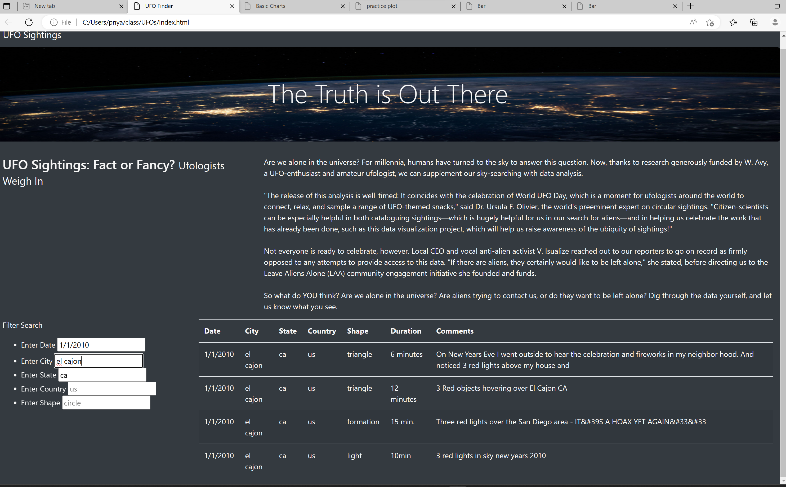
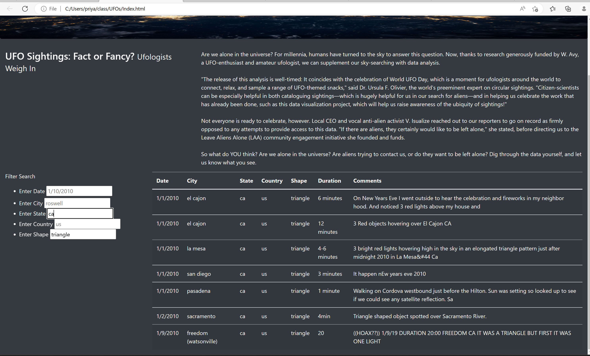

# UFOs
# Overview Of Project
  ### About Project:
  In this project we learn how to design and create proper webpage with step by step planning and with agenda. From **Storyboarding** to **Customization the page with CSS*** we learn most of the thing in this project about creating webpage.List of the things we learned from this projects are below:
  
  * Storyboarding
  * JavaScript Functions
     * simple JavaScript Functions
     * Arrow Functions
  * For Loops
  * Dynamic Table
  * Use forEach in Table
  * Filters
  * If Statments
  * Bootstrap components
  * Adding Dataf
  *Costomize the Page with CSS
 we learn all the above steps which is neccesarry for customize the propare webpage or as I said that the basic things we learnt during this project.
# Results
  ### How to use this website:
  * Using this website is most easiest and common task how customer needs to be.
    * First, we have to access the website.
    * second, find the **Filter Search** title, under this title we can see the different paramaters and their titles.
    * Now, what we have to do is just type the name of paramaters or Ids from what you want to filter the data and thats it ,once you type your criteria or the Ids             inside the parameters and press enter n you will get your result.
    * In following image we filter the data **date,city and state** wise.
    
    * If you want to clear the Filter search then you just have to simply press the **Enter Button anywhere on the webpage area or refresh the page.**
    * In the image we can see that we use the filter on **state and shape** paramaters.
    

# Summury
  * In summury i want to describe something which is bothering me when i read the instruction in the challange and that is,
      * Why there is an instructions to remove the **Filter Table Button** even we can add one more Button **Remove Filter Button** which makes this website more                  reliable.
 
